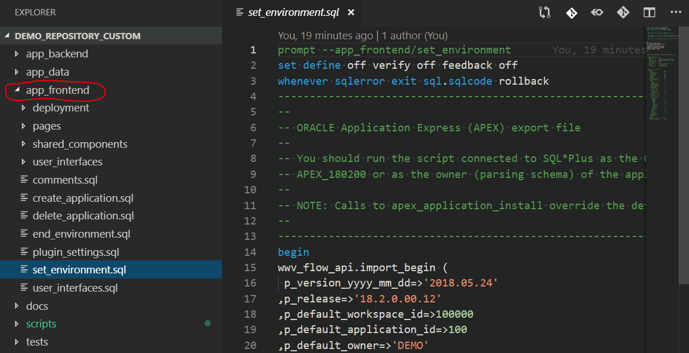

<!-- .slide: data-background-image="./assets/braden-collum-87874-unsplash.png" -->

# Schnellstart
## Versionskontrolle für (APEX-)Projekte
Ottmar Gobrecht 
DOAG Regionaltreffen 
München, 11. März 2019

---

## Zu meiner Person
- Oracle APEX Entwickler seit 2008 (APEX 3.0)
- Seit 2013 im Headquarter der Linde AG
- Bereich "Finance Applications and Reporting"
- Individualsoftware für Fachbereiche
- Aktiv im [Open Source Bereich](https://github.com/ogobrecht)

---

## Inhalt
- Repository: Grundgedanken
- Tools: DDL Export
- DDL: Umgang mit Skripten
- Geschwindigkeit: Releases beschleunigen
- Mehr Tools: Quellcode-Verwaltung, Editor
- Fazit

---

## Motivation
- Viele Projekte
- Unterschiedliche Versionskontrolle
  - Anderes Versionskontrollsystem
  - Andere Dateistruktur
  - Andere Release-Durchführung
- Schwerer Start bei erstem Blick

---

## Die Idee
### Download all in one
- Frontend (APEX App)
- Backend
- REST Services (in Planung)
- Script Templates
- Übersichtliche Dateistruktur

-----

<!-- .slide: data-background-image="./assets/darwin-vegher-638514-unsplash.png" -->

# Repository

---

## Verzeichnisstruktur

<!-- .element: width="100%" -->

---

## Kurze Wege (Backend)

<!-- .element: width="100%" -->

---

## Kurze Wege (Frontend)

<!-- .element: width="100%" -->

---

## Alle Skripte vereint

<!-- .element: width="100%" -->

---

## Git versus SVN

- Git ist schneller
- SVN braucht weniger Platz
- Git funktioniert offline
- SVN Rechteverwaltung is flexibler
- ...
- [Artikel zum Thema](https://entwickler.de/online/development/git-subversion-svn-versionskontrollsystem-579792227.html)

---

<!-- .slide: data-background-image="./assets/camylla-battani-784361-unsplash.png" -->

## Fragen?

-----

<!-- .slide: data-background-image="./assets/clark-young-135435-unsplash.png" -->

# Tools

---

## PL/SQL Developer

---

## SQL Developer

---

## Toad

---

## Package PLEX

---

<!-- .slide: data-background-image="./assets/frank-vex-1071763-unsplash.png" -->

## Fragen?

-----

<!-- .slide: data-background-image="./assets/andrea-cappiello-770323-unsplash.png" -->

# DDL

Anmerkung:

DDL = durch d ie Landschaft - von DEV über INT nach PROD

---

## Wiederanlauffähigkeit

---

## Änderungen an Tabellen

---

<!-- .slide: data-background-image="./assets/alexander-andrews-511680-unsplash.png" -->

## Fragen?

-----

<!-- .slide: data-background-image="./assets/james-thomas-125093-unsplash.png" -->

# Geschwindigkeit

---

## Nur Shell Scripte

---

## Startpunkt für CI/CD

---

<!-- .slide: data-background-image="./assets/evan-dennis-75563-unsplash.png" -->

## Fragen?

-----

<!-- .slide: data-background-image="./assets/ricky-kharawala-308072-unsplash.png" -->

# Mehr Tools

---

## GitHub Desktop
- Multi-Dateivergleich
- Easy Undo
- Branching and Merging
- Weiterführende Infos

---

## Demo

---

## Visual Studio Code
- Projektweites Suchen und Ersetzen
- Parameter und Multi-Cursor
- Integriertes Terminal

---

## Demo

---

<!-- .slide: data-background-image="./assets/kevin-grieve-660962-unsplash.png" -->

## Fragen?

-----

<!-- .slide: data-background-image="./assets/matt-lamers-683008-unsplash.png" -->

# Fazit

---

- Übersichtliches Repository
- Dateibasiertes Arbeiten
- Immer Skripte
- Wiederanlauffähigkeit
- Next Step: CI/CD

---

<!-- .slide: data-background-image="./assets/nick-de-partee-97063-unsplash.png" -->

# The End

## Fragen?

[ogobrecht.github.io][43]

[43]: https://ogobrecht.github.io

-----

# Anhang

---

## Links
- xxx
- yyy
- zzz
