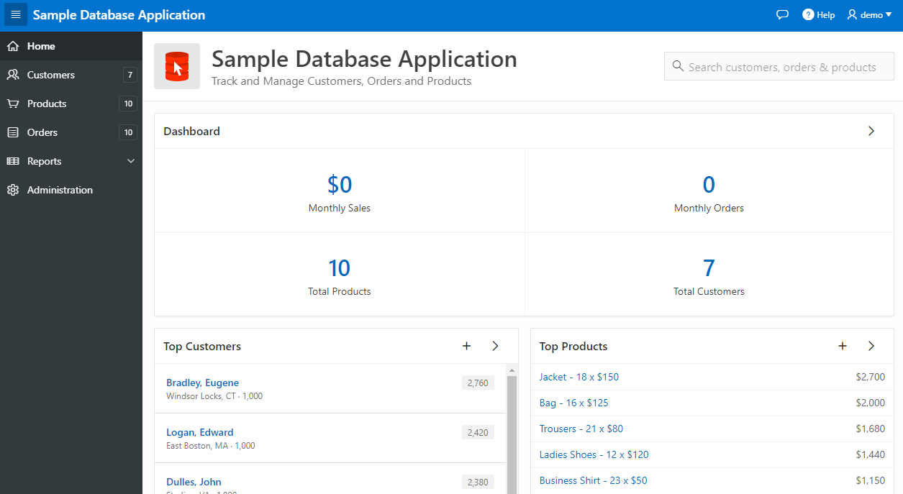
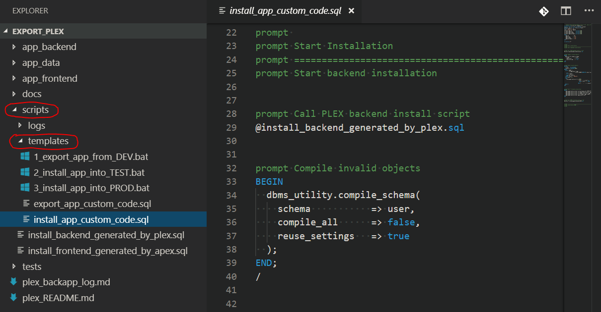
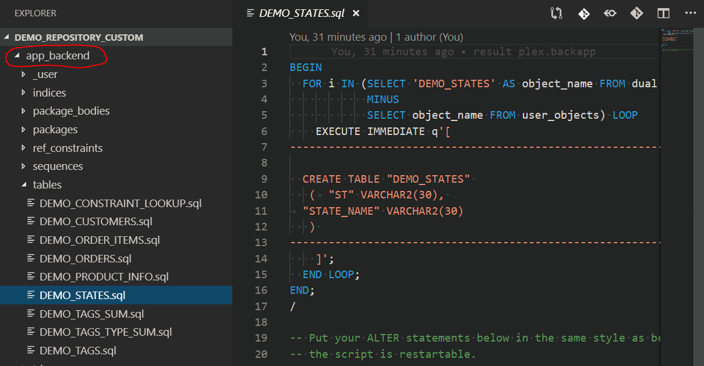

<!-- .slide: data-background-image="./assets/braden-collum-87874-unsplash.jpg" -->

# Schnellstart
## Versionskontrolle für (APEX-)Projekte
Ottmar Gobrecht<br>
DOAG Regionaltreffen<br>
München, 11. März 2019

---

## Zu meiner Person
- Oracle APEX Entwickler seit 2008 (APEX 3.0)
- Seit 2013 im Headquarter der Linde AG
- Individualsoftware für Fachbereiche
- Aktiv im [Open Source Bereich](https://github.com/ogobrecht)

---

## Zu Eurer Person
- Wer nutzt Versionskontrolle?
- Wer nutzt Git? SVN? Etwas anderes?
- Wer verscriptet seine Releases?
- Wer nutzt CI/CD?

---

## Inhalt
### Aufbau eines Quellcode-Repos
- Toolvergleich: Export Schema DDL
- Scripte & Wiederanlauffähigkeit
- Mehr Tools: Quellcode-Verwaltung, Editor
- Fazit

---

## Motivation
- Viele Projekte
- Unterschiedliche Versionskontrolle
  - Anderes Versionskontrollsystem
  - Andere Dateistruktur
  - Andere Release-Durchführung
- Schwerer Start bei erstem Blick

---

## Das Ziel: Download all in one
- Frontend (APEX App)
- Backend (Schema DDL)
- Daten (Katalogdaten)
- Script Templates
- Wiederanlauffähigkeit
- Übersichtliche Dateistruktur

---

## Das Ziel: Verzeichnisstruktur


Anmerkungen:

- Kurze Wege
- Alle Scripte vereint
- Tracking von Katalogdaten

---

<!-- .slide: data-background-image="./assets/michael-d-beckwith-575798-unsplash.jpg" -->

> “There is no clean (database) development without Version Control”
>
> Samuel Nitsche ([Blog Post](https://cleandatabase.wordpress.com/2017/09/22/there-is-no-clean-database-development-without-version-control/))

-----

<!-- .slide: data-background-image="./assets/clark-young-135435-unsplash.jpg" -->

# Tools

---

## Tool-Vergleich DDL Export
- Aufruf Funktionalität
- Eine Script-Datei pro Objekt?
- Unterverzeichnisse pro Objekttyp?
- Eigene Dateien FK Constraints?
- "Object already exist" verhinderbar?
- Daten exportiertbar?
- APEX App exportiertbar?

---

## Export Schema DDL

| Tool             | Aufruf                                     |
|------------------|--------------------------------------------|
| SQL Developer    | Extras > Datenbankexport                   |
| PL/SQL Developer | Tools > Export Schema Objects              |
| Toad             | Database > Export > Generate Schema Script |

---

## Vergleich Funktionalität

| Kriterium             | SQL<br>Dev. | PL/SQL<br>Dev. | Toad       |
|-----------------------|-------------|----------------|------------|
| Datei pro Objekt      | Ja          | Ja             | Ja         |
| Unterverz. pro Typ    | Ja          | Nein           | Ja         |
| FK Constr. extra      | Ja          | Nein           | Ja         |
| Verhi. "object exist" | Nein        | Nein           | Nein       |
| Export Daten          | Ja          | Nein           | ***Jein*** |
| Export APEX App       | ***Jein***  | Nein           | Nein       |

---

## Vergleich Funktionalität

| Kriterium             | SQL<br>Dev. | PL/SQL<br>Dev. | Toad       | PLEX    |
|-----------------------|-------------|----------------|------------|---------|
| Datei pro Objekt      | Ja          | Ja             | Ja         | Ja      |
| Unterverz. pro Typ    | Ja          | Nein           | Ja         | Ja      |
| FK Constr. extra      | Ja          | Nein           | Ja         | Ja      |
| Verhi. "object exist" | Nein        | Nein           | Nein       | Ja      |
| Export Daten          | Ja          | Nein           | ***Jein*** | Ja      |
| Export APEX App       | ***Jein***  | Nein           | Nein       | Ja      |

---

## Anmerkungen SQL Developer
- Ist am übersichtlichsten
- Viele Formate für Datenexport (auch CSV)
- Umfangreich konfigurierbar
- Blain Carter: [CI/CD for Database Developers – Export Database Objects into Version Control](https://learncodeshare.net/2018/07/16/ci-cd-for-database-developers-export-database-objects-into-version-control/)

---

## Anmerkungen PL/SQL Developer
- Wenig konfigurierbar
- Enttäuscht für Aufbau Quellcode-Repos

---

## Anmerkungen Toad 
- Zwei Exportmöglichkeiten (mindestens)
  - Entweder Unterverzeichnisse pro Objekttyp...
  - ... oder Daten
- Daten nur als Insert Statements
- Umfangreich konfigurierbar, unübersichtlich

---

## Anmerkungen PLEX
- Ist ein Package (<span style="color:red;">PL</span>/SQL <span style="color:red;">Ex</span>port Utilities)
- Ausgabeverzeichnisstruktur anpassbar
- Benötigt APEX 5.1.4 oder höher
- [Projekt auf GitHub](https://github.com/ogobrecht/plex)

---

## Git versus SVN
- Git ist schneller
- SVN braucht weniger Platz
- Git funktioniert offline
- SVN Rechteverwaltung is flexibler
- ... ein echter Grabenkampf
- Beruhigungsmittel: [Artikel zum Thema](https://entwickler.de/online/development/git-subversion-svn-versionskontrollsystem-579792227.html)
- Tip Windows Server: [Git](https://gitea.io/), [SVN](https://www.visualsvn.com/server/)

---

<!-- .slide: data-background-image="./assets/camylla-battani-784361-unsplash.jpg" -->

## Fragen?

-----

<!-- .slide: data-background-image="./assets/tim-easley-326493-unsplash.jpg" -->

# PLEX

---

## Ausgangsbasis: Sample DB App



---

## Möglicher Erstexport

```sql
WITH
  FUNCTION backapp RETURN BLOB IS
  BEGIN
    RETURN plex.to_zip(plex.backapp(
      p_app_id               => 100,  -- If null, we simply skip the APEX app export.
      p_include_object_ddl   => true, -- If true, include DDL of current user/schema and all its objects.
      p_include_templates    => true, -- If true, include templates for README.md, export and install scripts.
      p_include_runtime_log  => true, -- If true, generate file plex_backapp_log.md with runtime statistics.
      p_include_data         => true, -- If true, include CSV data of each table.
      p_data_table_name_like => 'DEMO_PRODUCT_INFO,DEMO_STATES' -- A comma separated list of like expressions to filter the tables - example: 'EMP%,DEPT%' will be translated to: where ... and (table_name like 'EMP%' escape '\' or table_name like 'DEPT%' escape '\').  
    ));
  END backapp;

SELECT backapp FROM dual;
```

[Blog Post](https://ogobrecht.github.io/posts/2018-08-26-plex-plsql-export-utilities/)

Anmerkungen:

- Zip file nur beim allerersten Schritt sinnvoll/notwendig
- Später sollte man Scripte benutzen
- Siehe auch Ordner Zip/scripts/templates

---

## Speichern als ZIP


---

## Das entpackte ZIP File



---

## Zur Erinnerung: Unser Ziel


---

## Anpassen Verzeichnisstruktur

```sql
DECLARE
  l_files apex_t_export_files;
BEGIN
  l_files := plex.backapp(p_app_id => 100);
  FOR i IN 1..l_files.count LOOP
    -- relocate APEX app files from app_frontend to app_ui
    IF l_files(i).name LIKE 'app_frontend/%' THEN
      l_files(i).name := replace(l_files(i).name, 'app_frontend/', 'app_ui/');
      l_files(i).contents := replace(l_files(i).contents, 'prompt --app_frontend/', 'prompt --app_ui/');
    END IF;
    -- correct file links in install script
    IF l_files(i).name = 'scripts/install_frontend_generated_by_apex.sql' THEN
      l_files(i).contents := replace(l_files(i).contents, '@../app_frontend/', '@../app_ui/');
    END IF;
  END LOOP;
END;
```

---

## PLEX.BackApp Rückgabeformat

```sql
-- PUBLIC APEX TYPES

-- apex_t_export_file
TYPE wwv_flow_t_export_file IS OBJECT (
  name     VARCHAR2(255),
  contents CLOB
)

-- apex_t_export_files
TYPE wwv_flow_t_export_files IS
  TABLE OF wwv_flow_t_export_file
```

---

## Skripte anpassen bei Verwendung


---

## SYS-Objekte

- Bei Export exkludieren oder umbenennen
- Einiges versucht PLEX schon richtig zu machen
- Ziel: Keine SYS-Objekte im Repository

---

<!-- .slide: data-background-image="./assets/kevin-grieve-660962-unsplash.jpg" -->

## Fragen?

-----

<!-- .slide: data-background-image="./assets/andrea-cappiello-770323-unsplash.jpg" -->

# DDL

Anmerkung:

DDL = durch die Landschaft - von DEV über INT nach PROD

---

## Wiederanlauffähigkeit



---

## Das Problem
### Tabellenänderungen
- Erneuter DDL Export
- Alter-Statements weg
- Was nun?

---

## Die Lösung
### Kopie Create Script
- Beispiel: DEMO_STATES.dev.sql
- Einhängen in custom install script

---

## Beispiel: Create Script


---

## Beispiel: Custom Install Script


---

<!-- .slide: data-background-image="./assets/kawtar-cherkaoui-125346-unsplash.jpg" -->

## Fragen?

-----

<!-- .slide: data-background-image="./assets/james-thomas-125093-unsplash.jpg" -->

# Geschwindigkeit

---

## Nur Shell Scripte
- Kein manueller App Export/Import
- Alle Scripte Wiederanlauffähig
- Mehrarbeit, die sich auszahlt

---

## Demo App Export/Import

---

<!-- .slide: data-background-image="./assets/wayne-bishop-5737-unsplash.jpg" -->

## Fragen?

-----

<!-- .slide: data-background-image="./assets/ricky-kharawala-308072-unsplash.jpg" -->

# Mehr Tools

---

## GitHub Desktop
- Multi-Platform (Linux WiP)
- Reduziert auf das Wesentliche
- Easy Undo
- Multi-Dateivergleich
- Branching and Merging
- ...
- [Homepage](https://desktop.github.com/)

---

## Demo

---

## Visual Studio Code
- Multi-Platform
- Git integriert
- Projektweites Suchen und Ersetzen
- Integriertes Terminal
- Multi-Cursor
- [PL/SQL Unterstützung](https://github.com/zabel-xyz/plsql-language)
- ...
- [Homepage](https://code.visualstudio.com/)

---

## Demo

---

<!-- .slide: data-background-image="./assets/alexander-andrews-511680-unsplash.jpg" -->

## Fragen?

-----

<!-- .slide: data-background-image="./assets/matt-lamers-683008-unsplash.jpg" -->

# Fazit
- Übersichtliches Repository
- Dateibasiertes Arbeiten
- Immer Scripte
- Wiederanlauffähigkeit
- Next Step: CI/CD

---

<!-- .slide: data-background-image="./assets/nick-de-partee-97063-unsplash.jpg" -->

# The End

## Fragen?

[ogobrecht.github.io](https://ogobrecht.github.io)

[Hintergründe von unsplash.com](https://unsplash.com/collections/4373998/quickstart-version-control-for-oracle-apex-projects)

