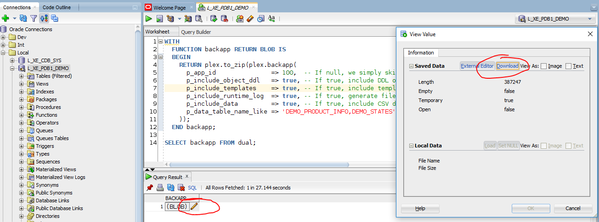

<!-- .slide: data-background-image="./assets/braden-collum-87874-unsplash.jpg" -->

# Schnellstart
## Versionskontrolle für (APEX-)Projekte
Ottmar Gobrecht<br>
DOAG Regionaltreffen<br>
München, 11. März 2019

---

## Zu meiner Person
- Oracle APEX Entwickler seit 2008 (APEX 3.0)
- Seit 2013 im Headquarter der Linde AG
- Bereich "Finance Applications and Reporting"
- Individualsoftware für Fachbereiche
- Aktiv im [Open Source Bereich](https://github.com/ogobrecht)

---

## Zu Eurer Person
- Wer nutzt Versionskontrolle?
- Wer nutzt Git? SVN? Etwas anderes?
- Wer verScriptet seine Releases?
- Wer nutzt CI/CD?

---

## Inhalt
- Repository: Grundgedanken
- Tools: DDL Export
- DDL: Umgang mit Scripten
- Geschwindigkeit: Releases beschleunigen
- Mehr Tools: Quellcode-Verwaltung, Editor
- Fazit

---

## Motivation
- Viele Projekte
- Unterschiedliche Versionskontrolle
  - Anderes Versionskontrollsystem
  - Andere Dateistruktur
  - Andere Release-Durchführung
- Schwerer Start bei erstem Blick

---

## Die Idee
### Download all in one
- Frontend (APEX App)
- Backend
- REST Services (in Planung)
- Script Templates
- Übersichtliche Dateistruktur

---

<!-- .slide: data-background-image="./assets/raphael-schaller-88040-unsplash.jpg" -->

> “There is no clean (database) development without Version Control”
>
> [Blog Post von Samuel Nitsche](https://cleandatabase.wordpress.com/2017/09/22/there-is-no-clean-database-development-without-version-control/)

-----

<!-- .slide: data-background-image="./assets/darwin-vegher-638514-unsplash.jpg" -->

# Repository

---

## Verzeichnisstruktur


<!-- .element: width="100%" -->

---

## Kurze Wege (Backend)


<!-- .element: width="100%" -->

---

## Kurze Wege (Frontend)


<!-- .element: width="100%" -->

---

## Alle Scripte vereint


<!-- .element: width="100%" -->

---

## Git versus SVN
- Git ist schneller
- SVN braucht weniger Platz
- Git funktioniert offline
- SVN Rechteverwaltung is flexibler
- ... ein echter Grabenkampf
- Beruhigungsmittel: [Artikel zum Thema](https://entwickler.de/online/development/git-subversion-svn-versionskontrollsystem-579792227.html)
- Tip Windows Server: [Git](https://gitea.io/), [SVN](https://www.visualsvn.com/server/)

---

<!-- .slide: data-background-image="./assets/camylla-battani-784361-unsplash.jpg" -->

## Fragen?

-----

<!-- .slide: data-background-image="./assets/clark-young-135435-unsplash.jpg" -->

# Tools

---

## Tool-Vergleich DDL Export
- Wie ruft man die Funktionalität auf?
- Eine Script-Datei pro Objekt möglich?
- Unterverzeichnisse pro Objekttyp möglich?
- Eigene Dateien für FK Constraints?
- "Object already exist" verhinderbar?
- Können Daten exportiert werden?
- Kann eine APEX App exportiert werden?

---

## Export Schema DDL

| Tool             | Aufruf                                     |
|------------------|--------------------------------------------|
| Package PLEX     | SQL Function `plex.backapp`                |
| PL/SQL Developer | Tools > Export Schema Objects              |
| SQL Developer    | Extras > Datenbankexport                   |
| Toad             | Database > Export > Generate Schema Script |

---

## Vergleich Funktionalität

| Kriterium             | PLEX    | PL/SQL<br>Dev. | SQL<br>Dev. | Toad       |
|-----------------------|---------|----------------|-------------|------------|
| Datei pro Objekt      | Ja      | Ja             | Ja          | Ja         |
| Unterverz. pro Typ    | Ja      | Nein           | Ja          | Ja         |
| FK Constr. extra      | Ja      | Nein           | Ja          | Ja         |
| Verhi. "object exist" | Ja      | Nein           | Nein        | Nein       |
| Export Daten          | Ja      | Nein           | Ja          | ***Jein*** |
| Export APEX App       | Ja      | Nein           | Nein        | Nein       |

---

## Anmerkungen Toad 
- Kennt zwei Exportmöglichkeiten (mindestens)
- Entweder Unterverzeichnisse pro Objekttyp oder Daten (je nach gewähltem Export)
- Kann nur Insert Statements exportieren
- Sehr umfangreich konfigurierbar, aber unübersichtlich

---

## Anmerkungen SQL Developer
- Ist am übersichtlichsten
- Viele Formate für Datenexport (auch CSV)
- Umfangreich konfigurierbar
- Blain Carter: [CI/CD for Database Developers – Export Database Objects into Version Control](https://learncodeshare.net/2018/07/16/ci-cd-for-database-developers-export-database-objects-into-version-control/)

---

## Anmerkungen PL/SQL Developer
- Wenig konfigurierbar
- Enttäuscht bezüglich Aufbau eines Quellcode-Repos

---

## Anmerkungen PLEX
- Wenig konfigurierbar bezüglich DDL Optionen
- Überzeugt beim Aufbau eines Quellcode Repos (wurde dafür entwickelt)
- Kann nur CSV Daten exportieren (by design)
- Liefert auch Script-Templates
- Output Verzeichnisstruktur kann angepasst werden
- Benötigt APEX 5.1.4 oder höher

---

## Sample Database Application


---

## Package PLEX verwenden

```sql
WITH
  FUNCTION backapp RETURN BLOB IS
  BEGIN
    RETURN plex.to_zip(plex.backapp(
      p_app_id               => 100,
      p_include_object_ddl   => true
    ));
  END backapp;

SELECT
  backapp
FROM
  dual;
```

Siehe auch [diesen Blog Post](https://ogobrecht.github.io/posts/2018-08-26-plex-plsql-export-utilities/)

Anmerkung:

- Zip file nur beim allerersten Schritt sinnvoll/notwendig
- Später sollte man Scripte benutzen
- Siehe auch Ordner Zip/scripts/templates

---

## Export als ZIP



---

## Downloaded ZIP File


---

<!-- .slide: data-background-image="./assets/frank-vex-1071763-unsplash.jpg" -->

## Fragen?

-----

<!-- .slide: data-background-image="./assets/andrea-cappiello-770323-unsplash.jpg" -->

# DDL

Anmerkung:

DDL = durch die Landschaft - von DEV über INT nach PROD

---

## Wiederanlauffähigkeit

---

## Änderungen an Tabellen

---

<!-- .slide: data-background-image="./assets/alexander-andrews-511680-unsplash.jpg" -->

## Fragen?

-----

<!-- .slide: data-background-image="./assets/james-thomas-125093-unsplash.jpg" -->

# Geschwindigkeit

---

## Nur Shell Scripte

---

## Startpunkt für CI/CD

---

<!-- .slide: data-background-image="./assets/evan-dennis-75563-unsplash.jpg" -->

## Fragen?

-----

<!-- .slide: data-background-image="./assets/ricky-kharawala-308072-unsplash.jpg" -->

# Mehr Tools

---

## GitHub Desktop
- Multi-Dateivergleich
- Easy Undo
- Branching and Merging
- Weiterführende Infos

---

## Demo

---

## Visual Studio Code
- Projektweites Suchen und Ersetzen
- Parameter und Multi-Cursor
- Integriertes Terminal

---

## Demo

---

<!-- .slide: data-background-image="./assets/kevin-grieve-660962-unsplash.jpg" -->

## Fragen?

-----

<!-- .slide: data-background-image="./assets/matt-lamers-683008-unsplash.jpg" -->

# Fazit

---

- Übersichtliches Repository
- Dateibasiertes Arbeiten
- Immer Scripte
- Wiederanlauffähigkeit
- Next Step: CI/CD

---

<!-- .slide: data-background-image="./assets/nick-de-partee-97063-unsplash.jpg" -->

# The End

## Fragen?

[ogobrecht.github.io](https://ogobrecht.github.io)

[Hintergründe von unsplash.com](https://unsplash.com/collections/4373998/quickstart-version-control-for-oracle-apex-projects)

