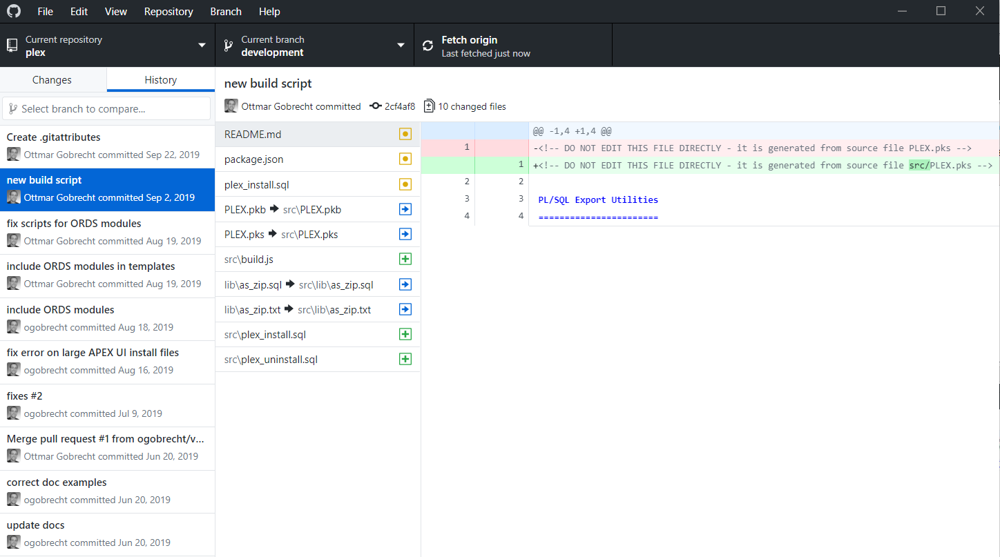

<!-- .slide: data-background-image="/assets/images/braden-collum-87874-unsplash.jpg" -->

# Schnellstart
## Versionskontrolle für existierende Projekte
Ottmar Gobrecht<br>
DOAG Konferenz<br>
Nürnberg, 19. November 2019

---

## Was Euch erwartet
- Motivation: DevOps, der erste Schritt
- Toolvergleich: Export Schema DDL
- Repositoryaufbau: Tool PLEX
- DDL: Skripte & Wiederanlauffähigkeit
- Mehr Tools: Git-Client, Editor, Liquibase
- Fazit & nächste Schritte

---

## Zu meiner Person
- Oracle APEX Entwickler seit 2008 (APEX 3.0)
- Seit 2013 im Headquarter der Linde AG
- Individualsoftware für Fachbereiche
- Aktiv im [Open Source Bereich](https://github.com/ogobrecht)

---

## Zu Eurer Person
- Wer nutzt Versionskontrolle?<!-- .element: class="fragment"-->
- Wer nutzt Git? SVN? Etwas anderes?<!-- .element: class="fragment"-->
- Wer verskriptet seine Releases?<!-- .element: class="fragment"-->
- Wer hat CI/CD implementiert?<!-- .element: class="fragment"-->

-----

<!-- .slide: data-background-image="/assets/images/danielle-macinnes-IuLgi9PWETU-unsplash.jpg" -->

# Motivation

---

## Tweet vom 7. Oktober 2019


---

## Motivation - Intern
- Viele Projekte
- Unterschiedliche Versionskontrolle
  - Anderes Versionskontrollsystem
  - Andere Dateistruktur
  - Andere Release-Durchführung
- Schwerer Start bei erstem Blick

Kurz: Deployment Pain

---

## Motivation - DevOps

Leistungsstarke gegenüber leistungsschwachen Unternehmen laut [State of DevOps Report 2017](https://puppet.com/resources/whitepaper/2017-state-of-devops-report)

- 46-mal häufigere Code Deployments
- 440-mal schneller von Commit zu Deployment
- 96-mal schnellere Wiederherstellung nach Ausfällen
- 5-mal niedrigere Ausfallrate bei Änderungen

---

## Kann man das glauben?

Buchtip: [Das Mindset von DevOps - Accelerate](https://www.heise.de/developer/artikel/Das-Mindset-von-DevOps-Accelerate-4495067.html)

- Performance der Softwarebereitstellung
- 24 Schlüsselkompetenzen in 5 Kategorien
- Vorwort: [Martin Fowler](https://martinfowler.com/)
- Wissenschaftlich belegt

<small>Der Kern: Auf Kompetenzen, nicht auf Reife fokussieren.<br>
Verbesserungen kontinuierlich vorantreiben.</small>

---

## Die Kategorien

1. Continuous Delivery
2. Architektur
3. Produkt und Prozess
4. Lean Management und Monitoring
5. Kultur

---

## Continuous Delivery-Kompetenzen

Die ersten Schritte

1. Versionsverwaltung (unser Thema)
2. Deployment-Automatisierung
3. Continuous Integration
4. Trunk-basierte Entwicklung
5. Testautomatisierung
6. ...

---

## Kulturelle Kompetenzen - Beispiel ;-)

Kapitel 11: Führungskräfte und Manager,<br>
Transformationale Führung

> „Ermutigen Sie Ihre Belegschaft, mindestens einmal im Jahr technische Konferenzen zu besuchen und das dort Gelernte für das gesamte Team zusammenzufassen.“

---

## Unser Ziel - Schnellstart VCS

Export "all in one" für Versionskontrolle

- Frontend (APEX App, zerlegt)
- Backend (Schema DDL)
- Daten (Katalogdaten)
- Deployment Templates
- Wiederanlauffähigkeit
- Übersichtliche Dateistruktur

---

## Unser Ziel - Deployment Templements

- Jeweils EIN SQL-Skript
  - Export App
  - Install App
- Je Zielsystem ein Shell-Wrapper
  - DEV
  - INT
  - PROD
- Log für alle Schritte

---

## Gewünschte Verzeichnisstruktur


Anmerkungen:

- Kurze Wege
- Alle Skripte vereint
- Tracking von Katalogdaten

---

<!-- .slide: data-background-image="/assets/images/michael-d-beckwith-575798-unsplash.jpg" -->

> “There is no clean (database) development without Version Control”
>
> Samuel Nitsche ([Blog Post](https://cleandatabase.wordpress.com/2017/09/22/there-is-no-clean-database-development-without-version-control/))

-----

<!-- .slide: data-background-image="/assets/images/clark-young-135435-unsplash.jpg" -->

# Tools

---

## Tool-Vergleich DDL Export
- Aufruf Funktionalität
- Eine Skript-Datei pro Objekt?
- Unterverzeichnisse pro Objekttyp?
- Eigene Dateien FK Constraints?
- "Object already exist" verhinderbar?
- Daten exportierbar?
- APEX App exportierbar?

---

## Export Schema DDL

| Tool             | Aufruf                                     |
|------------------|--------------------------------------------|
| SQL Developer    | Extras > Datenbankexport                   |
| PL/SQL Developer | Tools > Export Schema Objects              |
| Toad             | Database > Export > Generate Schema Script |

---

## Vergleich Funktionalität

| Kriterium             | SQL<br>Dev. | PL/SQL<br>Dev. | Toad       |
|-----------------------|-------------|----------------|------------|
| Datei pro Objekt      | Ja          | Ja             | Ja         |
| Unterverz. pro Typ    | Ja          | Nein           | Ja         |
| FK Constr. extra      | Ja          | Nein           | Ja         |
| Verhi. "object exist" | Nein        | Nein           | Nein       |
| Export Daten          | Ja          | Nein           | ***Jein*** |
| Export APEX App       | ***Jein***  | Nein           | Nein       |

---

## Vergleich Funktionalität

| Kriterium             | SQL<br>Dev. | PL/SQL<br>Dev. | Toad       | PLEX    |
|-----------------------|-------------|----------------|------------|---------|
| Datei pro Objekt      | Ja          | Ja             | Ja         | Ja      |
| Unterverz. pro Typ    | Ja          | Nein           | Ja         | Ja      |
| FK Constr. extra      | Ja          | Nein           | Ja         | Ja      |
| Verhi. "object exist" | Nein        | Nein           | Nein       | Ja      |
| Export Daten          | Ja          | Nein           | ***Jein*** | Ja      |
| Export APEX App       | ***Jein***  | Nein           | Nein       | Ja      |

---

## Anmerkungen SQL Developer
- Ist am übersichtlichsten
- Viele Formate für Datenexport (auch CSV)
- Umfangreich konfigurierbar
- Blain Carter: [CI/CD for Database Developers – Export Database Objects into Version Control](https://learncodeshare.net/2018/07/16/ci-cd-for-database-developers-export-database-objects-into-version-control/)

---

## Anmerkungen PL/SQL Developer
- Wenig konfigurierbar
- Enttäuscht für Aufbau Quellcode-Repos

---

## Anmerkungen Toad 
- Zwei Exportmöglichkeiten (mindestens)
  - Entweder Unterverzeichnisse pro Objekttyp...
  - ... oder Daten
- Daten nur als Insert Statements
- Umfangreich konfigurierbar, unübersichtlich

---

## Anmerkungen PLEX
- Ist ein Package (<span style="color:red;">PL</span>/SQL <span style="color:red;">Ex</span>port Utilities)
- Ausgabeverzeichnisstruktur anpassbar
- APEX App zerlegt<br>(Änderungen im VCS nachvollziehbar)
- [Projekt auf GitHub](https://github.com/ogobrecht/plex)

---

<!-- .slide: data-background-image="/assets/images/camylla-battani-784361-unsplash.jpg" -->

## Fragen?

-----

<!-- .slide: data-background-image="/assets/images/gabriel-gabriel-wVB8tH5_L9s-unsplash.jpg" -->

# PLEX

---

## Ausgangsbasis: Sample DB App


---

## Möglicher Erstexport

```sql
WITH
  FUNCTION backapp RETURN BLOB IS
  BEGIN
    RETURN plex.to_zip(plex.backapp(
      p_app_id               => 100,
      p_include_object_ddl   => true,
      p_include_templates    => true,
      p_include_runtime_log  => true,
      p_include_data         => true,
      p_data_table_name_like => 'DEMO_PRODUCT_INFO,DEMO_STATES'
    ));
  END backapp;

SELECT backapp FROM dual;
```

[Blog Post](https://ogobrecht.github.io/posts/2018-08-26-plex-plsql-export-utilities/)

Anmerkungen:

- Zip file nur beim allerersten Schritt sinnvoll/notwendig
- Später sollte man Skripte benutzen
- Siehe auch Ordner Zip/scripts/templates

---

## Speichern als ZIP


---

## Das entpackte ZIP File


---

## Frontend zerlegt


---

## Kopierte Templates


---

## Skripte anpassen bei Verwendung


---

## Deployment Script Beispiel


---

## SYS-Objekte

- Bei Export exkludieren oder umbenennen
- Einiges versucht PLEX schon richtig zu machen
- Ziel: Keine SYS-Objekte im Repository

---

## Anpassen File Collection

```sql
DECLARE
  l_files apex_t_export_files;
BEGIN
  l_files := plex.backapp(p_app_id => 100);

  FOR i IN 1..l_files.count LOOP
    l_files(i).name := /*your code here*/;
    l_files(i).contents := /*your code here*/;
  END LOOP;
END;
```

---

<!-- .slide: data-background-image="/assets/images/kevin-grieve-660962-unsplash.jpg" -->

## Fragen?

-----

<!-- .slide: data-background-image="/assets/images/andrea-cappiello-770323-unsplash.jpg" -->

# DDL
## <span style="color:red;">D</span>urch <span style="color:red;">d</span>ie <span style="color:red;">L</span>andschaft ;-)
<!-- .element: class="fragment"-->

Von DEV über INT nach PROD
<!-- .element: class="fragment"-->

---

## Ab hier dateibasiertes Arbeiten
- Keine Änderungen über Klickibunti-Tools
- Alle Änderungen per Skript
- Nur noch deklarativen Code exportieren
  - ORDS-REST-Services
  - APEX-Frontend
  - ...

---

## Wiederanlauffähigkeit


---

## Die Idee dahinter

Agile DB-Entwicklung

Jede Änderung ist eine Migration

- [Wikipedia: Schema migration](https://en.wikipedia.org/wiki/Schema_migration)
- [Artikel Samuel Nitsche](https://cleandatabase.wordpress.com/2017/11/28/one-does-not-simply-update-a-database-migration-based-database-development/)
- [Artikel Martin Fowler](https://www.martinfowler.com/articles/evodb.html)


<small>Unser Ansatz ist nur eine mögliche Ausprägung der Idee</small>

---

<!-- .slide: data-background-image="/assets/images/kawtar-cherkaoui-125346-unsplash.jpg" -->

## Fragen?

-----

<!-- .slide: data-background-image="/assets/images/james-thomas-125093-unsplash.jpg" -->

# Geschwindigkeit

---

## Mehrarbeit, die sich auszahlt
- Nur Skripte
- Kein manueller App Export/Import
- Alle Skripte wiederanlauffähig
- Gesamtablauf getestet
- Reduzierte "Deployment Pain"

---

## Demo 

App Export/Import

---

## Apropos Deployment Pain
- Jede Umgebung ist individuell
- Mit den Skripten anfangen
- Kleine Schritte
- Immer besser werden
- Nicht stehenbleiben

---

<!-- .slide: data-background-image="/assets/images/wayne-bishop-5737-unsplash.jpg" -->

## Fragen?

-----

<!-- .slide: data-background-image="/assets/images/ricky-kharawala-308072-unsplash.jpg" -->

# Mehr Tools

---

## Git versus SVN
- Git ist schneller
- SVN braucht weniger Platz
- Git funktioniert offline
- SVN Rechteverwaltung ist flexibler
- Entscheidungshilfe: [Artikel zum Thema](https://entwickler.de/online/development/git-subversion-svn-versionskontrollsystem-579792227.html)
- Tipp Windows Server: [Git](https://gitea.io/), [SVN](https://www.visualsvn.com/server/)

---

## GitHub Desktop
- Multi-Plattform (Linux in Arbeit)
- Reduziert auf das Wesentliche
- Übersichtlich
- Funktioniert mit eigenen Git-Servern
- [Homepage](https://desktop.github.com/)

---

## GitHub Desktop



---

## Visual Studio Code
- Multi-Plattform
- Git integriert
- Terminal Integriert
- [PL/SQL Unterstützung](https://github.com/zabel-xyz/plsql-language)
- [Homepage](https://code.visualstudio.com/)

<small>Morten Braten: [Using VS Code for PL/SQL development](https://ora-00001.blogspot.com/2017/03/using-vs-code-for-plsql-development.html)</small>

---

## Visual Studio Code


---

## SQLcl

- APEX App Export
- Neu in 19.2: Liquibase

---

## Liquibase Examples

### FIXME

---

<!-- .slide: data-background-image="/assets/images/alexander-andrews-511680-unsplash.jpg" -->

## Fragen?

-----

<!-- .slide: data-background-image="/assets/images/matt-lamers-683008-unsplash.jpg" -->

# Fazit

---

## Was wir jetzt haben
- Übersichtliches Repository
- Dateibasiertes Arbeiten
- Immer Skripte
- Wiederanlauffähigkeit
- Deployment-Vorlagen

---

## Die Reise hat begonnen

Nächste Schritte

1. ~~Versionsverwaltung (unser Thema)~~
2. Deployment-Automatisierung
3. Continuous Integration
4. Trunk-basierte Entwicklung
5. Testautomatisierung
6. ...

---

## Obwohl...

Versionskontrolle nach DevOps meint<br>
"Alle Produktionsartefakte"

- ~~Anwendungscode~~
- Anwendungskonfigurationen
- Build-Skripte
- Systemkonfigurationen
- ...

Kurz: Infrastruktur als Code<!-- .element: class="fragment"-->

<small>Übrigens: Diese Folien sind auch Code - geschrieben in Markdown</small><!-- .element: class="fragment"-->

---

## Überspitzt formuliert

In einem Reifegradmodell wären wir jetzt fertig.

- Wir nutzen Versionskontrolle
- Fein, abgehakt, erledigt

In einem Kompetenzmodell schauen wir, was wir noch verbessern können und lernen ständig hinzu...

---

## Lesestoff 1

- Buchtip Heise Developer: [Das Mindset von DevOps - Accelerate - 24 Schlüsselkompetenzen, um leistungsstarke Technologieunternehmen zu entwickeln und zu skalieren](https://www.heise.de/developer/artikel/Das-Mindset-von-DevOps-Accelerate-4495067.html)
- Gareth Rushgrove: [Macht DevOps Unternehmen erfolgreicher?](https://www.silicon.de/41661475/macht-devops-unternehmen-erfolgreicher)
- Puppet: State of DevOps Report [2017](https://puppet.com/resources/whitepaper/2017-state-of-devops-report), [2018](https://puppet.com/resources/whitepaper/2018-state-of-devops-report), [2019](https://puppet.com/resources/whitepaper/state-of-devops-report)


---

## Lesestoff 2

- Antti Kirmanen: [Git vs. Subversion (SVN): Welches Versionskontrollsystem sollten Sie nutzen?](https://entwickler.de/online/development/git-subversion-svn-versionskontrollsystem-579792227.html)
- Martin Fowler: [Evolutionary Database Design](https://www.martinfowler.com/articles/evodb.html)
- Samuel Nitsche: [There is no clean (database) development without Version Control](https://cleandatabase.wordpress.com/2017/09/22/there-is-no-clean-database-development-without-version-control/)
- [“One does not simply update a database” – migration based database development](https://cleandatabase.wordpress.com/2017/11/28/one-does-not-simply-update-a-database-migration-based-database-development/)

---

## Lesestoff 3

- Blain Carter: [Tips to help PL/SQL developers get started with CI/CD](https://learncodeshare.net/2018/04/30/tips-to-help-pl-sql-developers-get-started-with-ci-cd/)
- [CI/CD for Database Developers – Export Database Objects into Version Control](https://learncodeshare.net/2018/07/16/ci-cd-for-database-developers-export-database-objects-into-version-control/)
- Jeff Smith: [19.X SQLcl Teaser: LIQUIBASE](https://www.thatjeffsmith.com/archive/2019/01/19-x-sqlcl-teaser-liquibase/)
- Denis Savenko: [Oracle APEX and ORDS deployments automation](https://dsavenko.me/apex-and-ords-deployments-automation/)

---

<!-- .slide: data-background-image="/assets/images/nick-de-partee-97063-unsplash.jpg" -->

# The End

## Fragen?

[ogobrecht.github.io](https://ogobrecht.github.io)

[Hintergrundfotos von unsplash.com](https://unsplash.com/collections/4373998)

